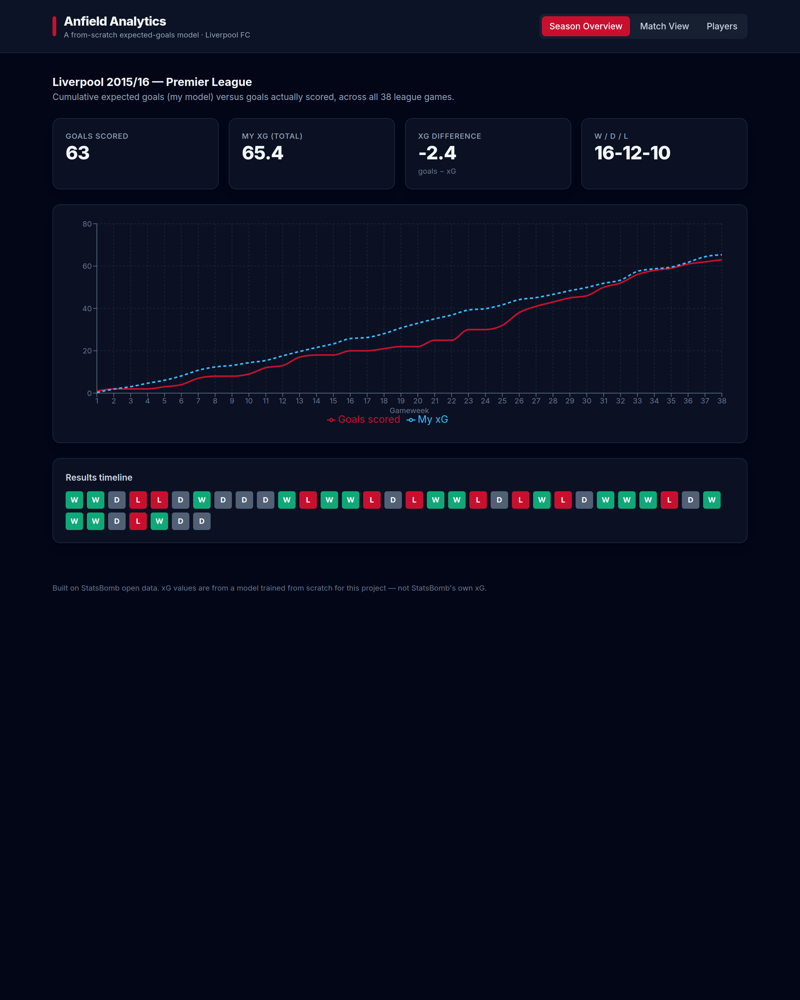
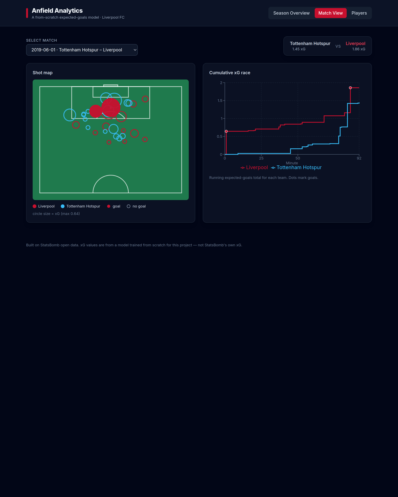
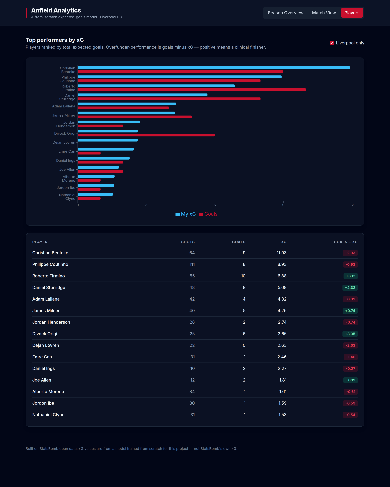

# Anfield Analytics

An **expected goals (xG) model built from scratch** on StatsBomb open data, with an
interactive dashboard for exploring Liverpool's shots, matches, and finishers.

xG estimates the probability that a given shot becomes a goal, based on where and
how it was taken. This project trains its own model (it does **not** reuse
StatsBomb's published xG), validates it on a held-out test set, and visualises the
results in a React dashboard.

**▶ Live demo:** https://beknazarov7.github.io/anfield-analytics/

---

## Dashboard

| Season overview | Match shot map | Player finishing |
|:---:|:---:|:---:|
|  |  |  |

- **Season overview** — cumulative xG vs goals across Liverpool's 2015/16 Premier League campaign, with a results timeline.
- **Match view** — a D3 shot map (position, xG-as-size, goals highlighted) and a cumulative "xG race" for any match, including the 2005 and 2019 Champions League finals.
- **Players** — every shooter ranked by xG, with over/under-performance (goals − xG) to separate clinical finishers from wasteful ones.

---

## Key results

The model is selected on **calibration** — for an xG model that gets summed over a
season, it matters more that "0.3 xG shots score ~30% of the time" than that the
model ranks shots perfectly. Two models were trained and compared on a stratified
25% held-out test set:

| Model | ROC-AUC ↑ | Log-loss ↓ | Brier ↓ | **ECE ↓** (calibration) |
|-------|:---------:|:----------:|:-------:|:-----------------------:|
| Logistic regression | 0.745 | 0.314 | 0.092 | 0.056 |
| **XGBoost** (selected) | **0.793** | **0.291** | **0.087** | **0.044** |

**Aggregate sanity check** (all 1,119 shots): the model's total xG is **124.3**
against **124 actual goals** — essentially spot-on at season scale, and closer to
reality than StatsBomb's own total (109.7) on this sample.

> ROC-AUC ≈ 0.79 is in line with published open xG models (~0.78–0.82). A perfect
> model is impossible here — finishing is genuinely noisy — so the goal is a
> *well-calibrated* estimate of chance quality, not perfect prediction.

---

## What the model found (Liverpool 2015/16)

- Liverpool created **65.4 xG** and scored **63 goals** — finishing almost exactly
  in line with chance quality across the season (final record 16-12-10, 8th).
- **Christian Benteke** generated the most xG (11.9) but **under-performed by ~3
  goals** — plenty of chances, poor conversion.
- **Roberto Firmino** (+3.1) and **Divock Origi** (+3.4) were the most clinical
  finishers, scoring well above their chance quality.

---

## How it works

A five-stage offline pipeline produces static data; the dashboard reads the
exported JSON directly (no backend).

```
StatsBomb open data
        │
        ▼
  src/ingest.py      → data/processed/shots.parquet      (download + cache shots)
        │
        ▼
  src/features.py    → data/processed/features.parquet   (distance, angle, …)
        │
        ▼
  src/xg_model.py    → models/{logreg,xgboost}.pkl        (train both models)
        │
        ▼
  src/evaluate.py    → models/xg_model.pkl + calibration  (score, pick the best)
        │
        ▼
  src/export_json.py → app/public/data/*.json             (season, shots, players)
        │
        ▼
  app/  (React + Vite + Tailwind)                         → the dashboard
```

### Methodology

**Features.** Each shot is reduced to five inputs grounded in football logic:

| Feature | Why it matters |
|---------|----------------|
| `distance_to_goal` | Euclidean distance to the goal centre — the single strongest predictor. |
| `angle_to_goal` | How wide the goal mouth appears from the shot location (a tight angle near the byline is hard). |
| `is_header` | Headers convert worse than shots with the feet. |
| `is_open_play` | Set pieces (penalties, free kicks) have very different scoring profiles. |
| `under_pressure` | Whether a defender was closing the shooter down. |

**Models.** A logistic regression (interpretable baseline) and an XGBoost model
(captures non-linear interactions). The logistic coefficients give a plain-English
read on each feature's effect; XGBoost is kept deliberately small (shallow trees,
low learning rate, subsampling) because the dataset is only ~1,100 shots.

**Selection.** Both are scored on a held-out set; the better-**calibrated** model
(lowest Expected Calibration Error) is promoted to `models/xg_model.pkl` and used
for the dashboard export. Calibration curves are saved to `models/`.

---

## Tech stack

- **Modelling:** Python · pandas · scikit-learn · XGBoost · matplotlib
- **Data:** [StatsBomb open data](https://github.com/statsbomb/open-data) via `statsbombpy`, cached as Parquet (`pyarrow`)
- **Dashboard:** React · Vite · Tailwind CSS · Recharts · D3 (scales/shapes)
- **Tests:** pytest

---

## Running it locally

### 1. The Python pipeline

```bash
python -m venv .venv && source .venv/bin/activate
pip install -r requirements.txt

python -m src.ingest        # download + cache shots (use --refresh to re-pull)
python -m src.features      # engineer xG features
python -m src.xg_model      # train logistic + XGBoost
python -m src.evaluate      # score, plot calibration, pick the best model
python -m src.export_json   # write JSON for the dashboard
```

Each stage prints a summary with built-in sanity checks (goal rate, calibration
metrics, season xG totals).

### 2. The dashboard

```bash
cd app
npm install
npm run dev        # http://localhost:5173
# or: npm run build && npm run preview   (production build)
```

### 3. Tests

```bash
pip install -r requirements-dev.txt
pytest
```

---

## Project structure

```
src/                Python pipeline (ingest → features → model → evaluate → export)
app/                React dashboard (reads app/public/data/*.json)
data/raw/           cached StatsBomb events (git-ignored, re-downloadable)
data/processed/     shots + engineered features (Parquet)
models/             trained models + calibration plots (git-ignored)
tests/              pytest sanity tests for the pipeline
screenshots/        dashboard screenshots used in this README
```

## Design note: retargeting to another league

The data sources and team filter are isolated as configuration
(`DATA_SOURCES` and `TEAM_FILTER` in [src/ingest.py](src/ingest.py); `TEAM` in
[app/src/lib/constants.js](app/src/lib/constants.js)). Pointing the whole project
at a different club or competition is a config change, not a rewrite — the feature
engineering, model, and dashboard are all team-agnostic.

---

## Credits

Built on [StatsBomb open data](https://github.com/statsbomb/open-data), free for
public research and education. All xG values shown are from the model trained in
this repository, not StatsBomb's own xG.
